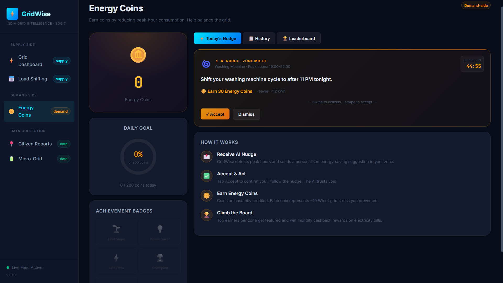
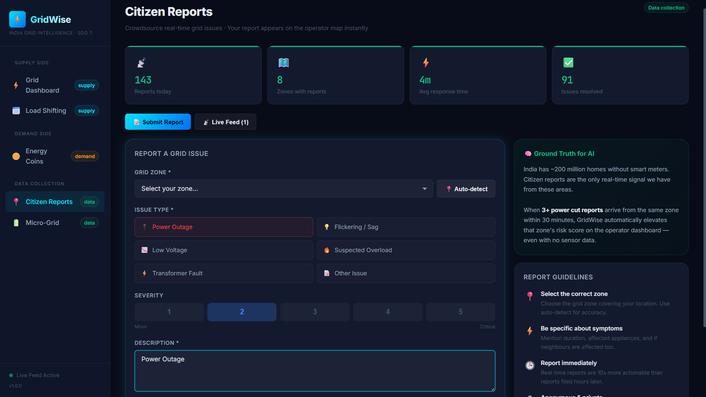
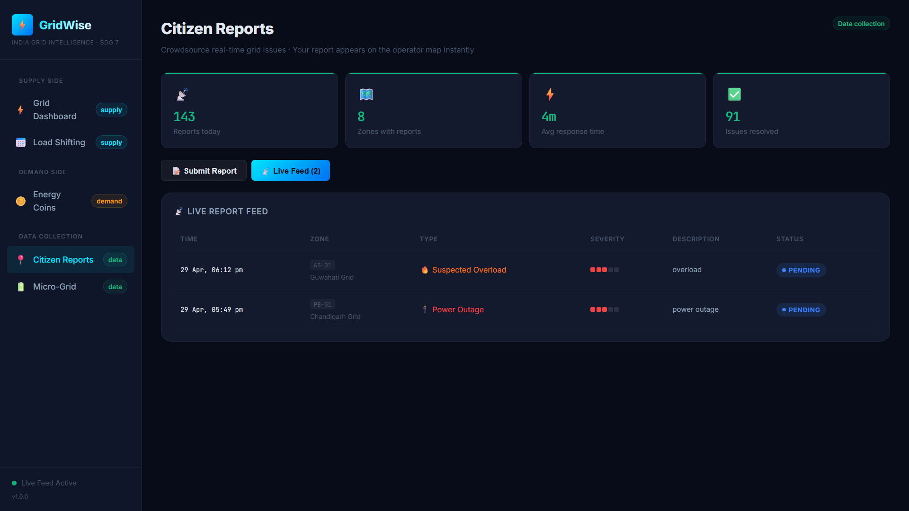
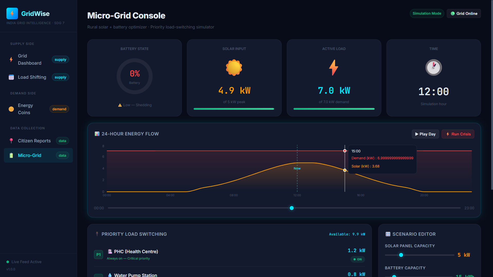
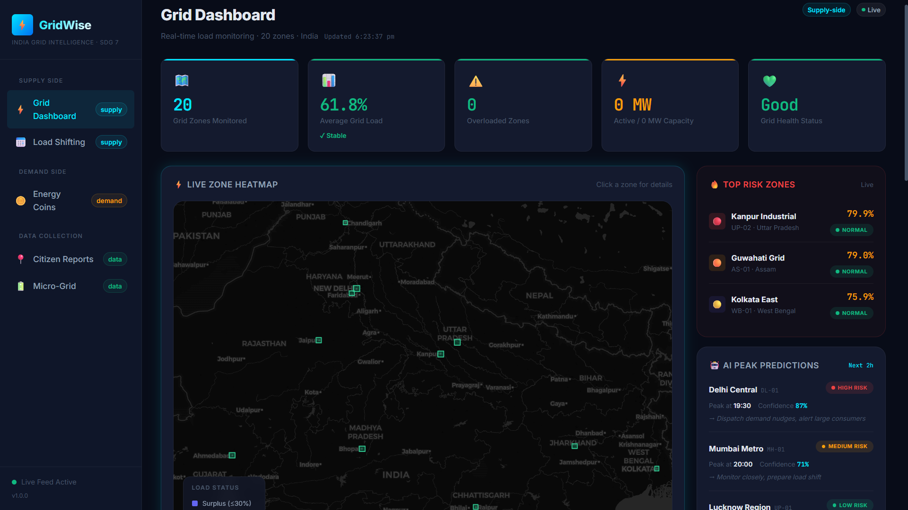
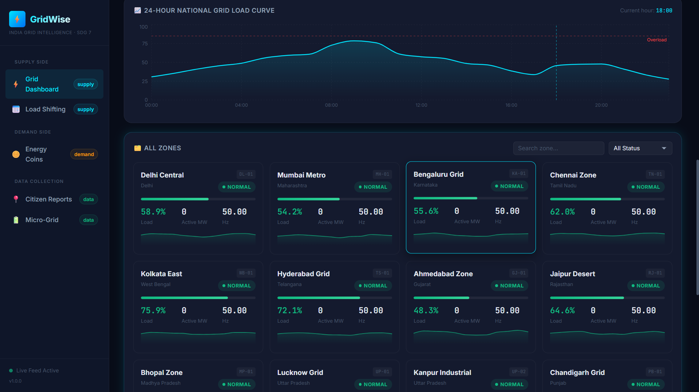

# GridWise ⚡

> **AI-powered electricity grid management platform for India**

GridWise tackles India's real-time supply-demand mismatch by combining **operator intelligence** (AI-predicted overloads, load shifting) with **citizen-driven demand reduction** (gamified nudges, crowdsourced reports) on a single live platform.

[](https://gridwise-demo.web.app)
[](https://firebase.google.com)
[](https://react.dev)
[](https://sdgs.un.org/goals/goal7)

---

## 📸 Screenshots

| Grid Dashboard | Energy Coins | Load Shifting |
|---|---|---|
|  |  |  |
| Real-time zone heatmap with AI predictions | Gamified nudges, leaderboard, coin wallet | FCM demand-response scheduler |

| Citizen Reports | Micro-Grid Console |
|---|---|
|  |  |
| Crowdsourced outage feed with geolocation | Solar + battery simulator with crisis playback |

| Additional View 1 | Additional View 2 |
|---|---|
|  |  |
| Detailed panel or feature view | Detailed panel or feature view |

---

## 🚀 Features

### ⚡ Supply Side — Operator Tools
| Feature | Description |
|---|---|
| **Live Zone Heatmap** | 20 Indian grid zones visualised on an interactive map with polygon overlays coloured by load status |
| **AI Peak Predictions** | Rule-based predictor (→ LSTM upgrade planned) forecasts zone overloads 1–2 hours ahead with confidence score |
| **24h Load Curve** | Recharts area chart showing historical + live national grid load vs. time |
| **Danger Zones Panel** | Top-3 highest-load zones pinned at all times with one-click targeting |
| **Zone Detail Panel** | Click any zone card to open a slide-in panel with sparkline, metrics, frequency, voltage, and AI action recommendation |
| **Alert Banner Stack** | Multi-alert toast stack with dismiss animation, auto-resolve, and Web Audio API sound toggle |
| **Load Shifting Scheduler** | Form to send FCM push notifications to large consumers (factories, malls, airports) with pre-built message templates |
| **Incentive Tier System** | Bronze → Silver → Gold tiers based on 30-day consumer compliance (5%, 10%, 15% rate discounts) |

### 🪙 Demand Side — Citizen Tools
| Feature | Description |
|---|---|
| **Energy Coins Wallet** | Gamified coin system — accept nudges to earn coins, track balance and transaction history |
| **AI Nudges** | Personalised energy-saving suggestions (AC temp, washing machine timing, standby devices) with countdown timer |
| **Swipe-to-Accept** | Card swipe gesture (right = accept, left = dismiss) with drag physics and visual hint overlay |
| **Coin Burst Animation** | Particle burst when coins are awarded |
| **Leaderboard** | Zone-based monthly leaderboard with streaks and trends |
| **Achievement Badges** | 5-tier badge system (First Steps → Legend) |
| **Citizen Reports** | Submit power outage/fault reports with GPS auto-detect, issue type picker, and severity scale |
| **Live Report Feed** | Real-time feed of all citizen reports with zone, type, and status |

### 🔋 Rural Micro-Grid Simulator
| Feature | Description |
|---|---|
| **24h Solar Arc** | Physics-based solar output curve (Gaussian model) driven by panel capacity slider |
| **Battery State Machine** | Real charge/discharge simulation with capacity slider |
| **Priority Load Switching** | Greedy algorithm: critical loads always on, essential/deferrable shed when available power drops |
| **Time Scrubber** | Drag or play through a 24h simulation day |
| **Crisis Playback** | Animated step-by-step "evening crisis" scenario showing AI shedding decisions |
| **Scenario Editor** | Live sliders for solar kW, battery kWh, and individual load values |

---

## 🏗️ Architecture

```
┌──────────────────────────────────────────────────────────┐
│                        FRONTEND                          │
│  React 18 + Vite  ·  React Router v6  ·  Recharts       │
│  React Leaflet (OSM tiles)  ·  Vanilla CSS               │
└──────────────────────┬───────────────────────────────────┘
                       │ Firebase SDK (realtime subscriptions)
┌──────────────────────▼───────────────────────────────────┐
│                   FIREBASE BACKEND                        │
│  RTDB  ──  /zones, /alerts, /nudges, /citizen_reports    │
│  Auth  ──  Anonymous auth for citizens                   │
│  Storage  ──  citizen report photos (planned)            │
│  FCM  ──  push notifications to large consumers          │
│  Functions  ──  alertTrigger, peakPredictor (planned)    │
│  Hosting  ──  gridwise-demo.web.app                      │
└──────────────────────┬───────────────────────────────────┘
                       │ Admin SDK
┌──────────────────────▼───────────────────────────────────┐
│                  DATA PIPELINE (Python)                   │
│  data/zones.json  ──  20 Indian grid zone definitions    │
│  data/seed.py     ──  Seeds RTDB with zone metadata      │
│  data/generate.py ──  Realistic live load simulation     │
│                        Indian load curve + peak events   │
└──────────────────────────────────────────────────────────┘
```

### RTDB Data Schema

```json
{
  "zones": {
    "DL-01": {
      "zoneId": "DL-01",
      "name": "Delhi Central",
      "state": "Delhi",
      "lat": 28.6139, "lng": 77.2090,
      "activeMW": 3842,
      "capacityMW": 4500,
      "currentLoad": 85.4,
      "frequencyHz": 49.97,
      "voltageKV": 220.2,
      "status": "overload",
      "lastUpdated": "2026-04-29T14:00:00Z"
    }
  },
  "alerts": { ... },
  "nudges": { ... },
  "citizen_reports": { ... },
  "users": {
    "{uid}": {
      "wallet": { "coins": 420 },
      "transactions": { ... }
    }
  }
}
```

---

## 💻 Tech Stack

| Layer | Technology |
|---|---|
| **Frontend** | React 18, Vite, React Router v6 |
| **Charts** | Recharts (AreaChart, LineChart, ResponsiveContainer) |
| **Maps** | React Leaflet (OpenStreetMap tiles) |
| **Animations** | Vanilla CSS keyframes, Web Animations API |
| **Styling** | Custom dark design system (vanilla CSS, CSS variables, no Tailwind) |
| **Database** | Firebase Realtime Database |
| **Auth** | Firebase Anonymous Auth |
| **Push Notifications** | Firebase Cloud Messaging (FCM) |
| **Cloud Functions** | Node.js 20 (in progress) |
| **Data Pipeline** | Python 3 + `firebase-admin` SDK |
| **Hosting** | Firebase Hosting |

---

## 🔧 Local Setup

### 1. Clone & install

```bash
git clone https://github.com/shivendu0103/GridWise.git
cd GridWise
npm install
```

### 2. Configure environment variables

Create a `.env` file in the project root:

```env
# Firebase project configuration (from Firebase Console → Project Settings)
VITE_FIREBASE_API_KEY=your_api_key
VITE_FIREBASE_AUTH_DOMAIN=your_project.firebaseapp.com
VITE_FIREBASE_DATABASE_URL=https://your_project-default-rtdb.firebaseio.com
VITE_FIREBASE_PROJECT_ID=your_project_id
VITE_FIREBASE_STORAGE_BUCKET=your_project.appspot.com
VITE_FIREBASE_MESSAGING_SENDER_ID=your_sender_id
VITE_FIREBASE_APP_ID=your_app_id

# (No API key needed for the Leaflet map as it uses OpenStreetMap)

# FCM VAPID key (Firebase Console → Cloud Messaging → Web Push)
VITE_FIREBASE_VAPID_KEY=your_vapid_key
```

> **Demo Mode**: If keys are missing, the app automatically falls back to rich simulated data. All pages are fully functional without any configuration.

### 3. Start the development server

```bash
npm run dev
```

Open [http://localhost:5173](http://localhost:5173).

### 4. Seed the Firebase database (optional, for live data)

```bash
# Place your Firebase service account key at:
# data/serviceAccountKey.json
# (Firebase Console → Project Settings → Service Accounts → Generate new private key)

cd data
pip install firebase-admin
python seed.py      # Creates 20 zone documents in RTDB
python generate.py  # Starts live load simulation (Ctrl+C to stop)
```

---

## 📁 Project Structure

```
GridWise/
├── src/
│   ├── App.jsx                    # Router, layout, error boundary
│   ├── main.jsx
│   ├── index.css                  # Full design system (dark theme, tokens, components)
│   ├── lib/
│   │   └── firebase.js            # Firebase init, RTDB helpers, demo-mode fallback
│   ├── pages/
│   │   ├── Dashboard.jsx          # ⚡ Grid operator dashboard
│   │   ├── LoadShift.jsx          # 📅 Load shifting scheduler + incentive tiers
│   │   ├── CoinWallet.jsx         # 🪙 Energy coins wallet + gamification
│   │   ├── CitizenApp.jsx         # 📍 Citizen outage reports + geolocation
│   │   └── MicroGrid.jsx          # 🔋 Rural micro-grid simulator
│   └── components/
│       ├── Sidebar.jsx            # Navigation sidebar with live alert badge
│       ├── ZoneCard.jsx           # Zone status card with load bar + sparkline
│       ├── ZoneMap.jsx            # React Leaflet polygon heatmap
│       ├── AlertBanner.jsx        # Toast alert stack with sound toggle
│       └── NudgeCard.jsx          # AI nudge card with swipe + countdown
├── data/
│   ├── zones.json                 # 20 Indian grid zone definitions
│   ├── seed.py                    # Firebase RTDB seeder
│   └── generate.py                # Live load simulation engine
├── public/
│   └── firebase-messaging-sw.js   # FCM service worker (planned)
├── .env                           # Environment variables (not committed)
└── vite.config.js
```

---

## 🤖 AI/ML Design

### Current (Rule-Based Predictor)
- Flags zones where `currentLoad > 85%` as high risk
- Assigns medium risk to `currentLoad > 70%`
- Computes peak time estimate based on Indian load curve patterns

### Planned Upgrade — LSTM Time Series Model
```
Features: [hour, day_of_week, zone_id, temperature, is_holiday]
Target:   Load at t+60min
Model:    LSTM (24h rolling window per zone)
Training: 90-day synthetic data from generate.py
Output:   (predicted_load, confidence_interval) → RTDB /predictions/
```

---

## 📊 Indian Grid Context

GridWise is calibrated for India's unique grid characteristics:

- **20 zones** covering major Indian cities and states (Delhi, Mumbai, Kolkata, Chennai, Bangalore, Lucknow, Ahmedabad, Jaipur, etc.)
- **Indian load curve**: dual-peak at 09:00 (morning) and 19:30–21:00 (evening — cooking + TV + AC)
- **Frequency target**: 50.00 Hz (±0.5 Hz acceptable range)
- **SDG 7 alignment**: Rural micro-grid module targets India's ~67,000 underserved villages

---

## 🗺️ Roadmap

- [x] Phase 1 — Foundation (Firebase, routing, design system, zone data)
- [x] Phase 2 — Dashboard (heatmap, sparklines, alerts, AI predictions)
- [x] Phase 3 — Gamification (coins, nudges, leaderboard, badges)
- [x] Phase 4 — Load Shifting (scheduler, FCM, incentive tiers)
- [x] Phase 5 — Citizen Reports (geolocation, live feed, severity)
- [x] Phase 6 — Micro-Grid (solar arc, battery sim, crisis playback)
- [ ] Phase 7 — ML Model (linear regression baseline → LSTM upgrade)
- [ ] Phase 8 — Cloud Functions (alertTrigger, peakPredictor, shiftNotifier)
- [ ] Phase 9 — Production Deploy (Firebase Hosting + CI/CD)

---

## 🙏 Acknowledgements

- **United Nations SDG 7** — Affordable and Clean Energy
- **India's Central Electricity Authority** — for open load data that informed simulation parameters
- **Firebase** — for making real-time infrastructure accessible to solo developers

---

## 📄 License

MIT © 2026 Shivendu
